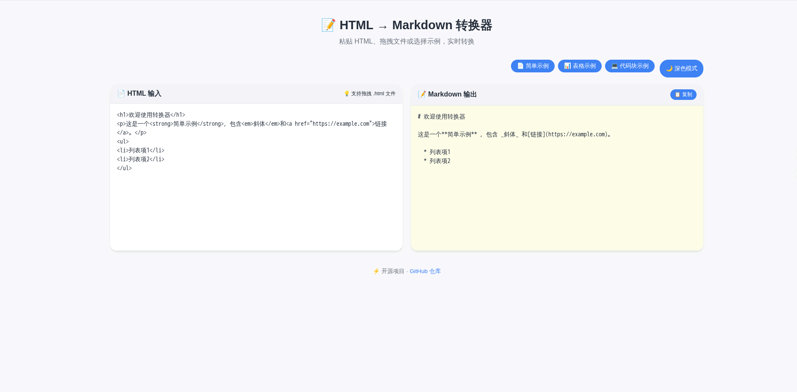

# HTML to Markdown 在线转换器

[简体中文](./README.md) | [English](./README.en.md)


一个基于 Flask 的轻量工具，可将 HTML 代码快速转换为 Markdown 文本，适合用于笔记、博客、文档或 Markdown 编辑器。

## ✨ 功能

- 🌗 **亮/暗主题切换** – 支持页面主题切换
- ⚡ **实时转换** – 输入即转换，带防抖优化，减少请求频率
- 🗂️ **拖拽 HTML 文件** – 支持直接拖入 `.html` 文件自动读取并转换
- 🖱️ **一键复制** – 将生成的 Markdown 结果复制到剪贴板
- ⬇️ **下载 Markdown** – 将生成内容保存为 `.md` 文件
- 🧹 **清空输入** – 一键清空 HTML 编辑区和结果区
- 🔍 **Markdown 预览** – 生成后实时渲染预览，并支持代码块高亮
- 🔎 **放大预览** – 点击可全屏展示预览面板，隐藏其他面板，方便阅读
- 🌐 **URL 转换** – 输入网页地址后直接抓取页面并转换为 Markdown
- 🧱 **侧边布局** – 切换为左右布局，编辑和预览并排显示，适合宽屏阅读
- 📚 **示例模板** – 内置简单文本、表格、代码块示例
- 📱 **响应式界面** – 兼容移动端与桌面端
- 🔓 **完全开源** – 可本地部署或二次开发

## ✨ 新增功能

- 🌐 **URL 转换** – 输入网页地址后直接抓取页面并转换为 Markdown。
- 🔔 **Toast 通知** – 操作完成后显示友好的通知提示。
- 🖼️ **模态框交互** – 提供更直观的 URL 输入体验。

这些功能进一步提升了用户体验，使工具更加高效和易用。

## 🚀 使用说明

1. 打开页面
2. 粘贴 HTML 代码，或拖入 `.html` 文件
3. 查看右侧生成的 Markdown 文本
4. 点击“复制”按钮复制结果

## 🔧 开发者说明

后端接口：`POST /convert`

请求示例：

```json
{ "html": "<p>示例</p>" }
```

响应示例：

```json
{ "markdown": "示例\n" }
```

后端 URL 转换接口：`POST /convert-url`

请求示例：

```json
{ "url": "https://example.com" }
```

响应示例：

```json
{ "markdown": "Example\n" }
```

> 当前页面会同时显示原始 Markdown 文本和渲染后的实时预览，代码块在预览中支持高亮显示。

## 🚀 在线体验

👉 [https://html-to-md-qfrj.onrender.com](https://html-to-md-qfrj.onrender.com)

> 注意：Render 免费实例可能会休眠，首次访问需要几秒唤醒。

## 🖼️ 界面预览



## 🛠️ 本地运行

### 前提条件
- Python 3.8 或更高版本
- pip 包管理器
- （可选）Git

### 安装与启动

```bash
# 1. 克隆仓库
git clone https://github.com/你的用户名/html-to-markdown-web.git
cd html-to-markdown-web

# 2. 创建虚拟环境（推荐）
python -m venv venv
source venv/bin/activate      # Linux / macOS
# 或 .\venv\Scripts\activate   # Windows

# 3. 安装依赖
pip install -r requirements.txt

# 4. 运行应用
python app.py
```

打开浏览器访问 `http://127.0.0.1:5000` 即可开始使用。

### ️ 使用 Docker 快速部署

本项目已提供 Docker 配置文件，可以快速启动：

```bash
# 方法一：使用 Docker
docker build -t html-to-md-converter .
docker run -d -p 5000:5000 --name html-to-md html-to-md-converter

# 方法二：使用 Docker Compose（推荐）
docker-compose up -d
```

访问 `http://localhost:5000` 即可使用。

## 📦 部署

### 📖 查看详细部署指南

**本项目提供了完整的部署文档，包含 6 种不同的部署方式：**

 **[查看完整部署指南 »](DEPLOYMENT.md)**

部署指南包括：
- ✅ **部署前准备清单**
- ☁️ **Render**（推荐 - 免费）
- 🚂 **Railway**（$5 免费额度）
-  **PythonAnywhere**（Python 专用）
-  **Fly.io**（全球边缘节点）
- 🐳 **Docker**（容器化部署）
- 🖥️ **VPS/云服务器**（生产环境）
- 📊 **部署对比表**（费用、难度、特性对比）
-  **故障排除指南**（8 个常见问题及解决方案）

---

### 快速部署到 Render

如果你想快速部署，可以按照以下简单步骤：

1. 将代码推送到 GitHub 仓库。
2. 登录 [Render](https://render.com) 并选择 **New Web Service**。
3. 连接你的 GitHub 仓库。
4. 使用以下配置：
   - **Environment**: `Python 3`
   - **Build Command**: `pip install -r requirements.txt`
   - **Start Command**: `gunicorn app:app --bind 0.0.0.0:$PORT`
5. 点击 **Create Web Service**，稍等片刻即可获得公网地址。

> 💡 **提示**：更多详细信息和故障排除，请查看 [DEPLOYMENT.md](DEPLOYMENT.md)

## 📁 项目结构

```
html-to-markdown-web/
├── app.py               # Flask 后端入口
├── requirements.txt     # Python 依赖
├── static/              # 静态资源（CSS、JS）
│   ├── css/
│   │   └── style.css
│   └── js/
│       └── main.js
├── templates/           # 前端模板文件
│   └── index.html
├── .gitignore           # Git 忽略文件
├── LICENSE              # MIT 许可证
└── README.md            # 项目说明
```

## 🤝 贡献

欢迎提交 Issue 或 Pull Request！任何改进建议都很有价值。

1. Fork 本仓库
2. 创建你的功能分支 (`git checkout -b feature/AmazingFeature`)
3. 提交修改 (`git commit -m 'Add some AmazingFeature'`)
4. 推送到分支 (`git push origin feature/AmazingFeature`)
5. 打开一个 Pull Request

## 📄 许可证

本项目采用 MIT 许可证。详情请见 [LICENSE](LICENSE) 文件。

## 🙏 致谢

- [Flask](https://flask.palletsprojects.com/) – 轻量级 Web 框架
- [html2text](https://github.com/Alir3z4/html2text) – HTML 转 Markdown 核心库
- [highlight.js](https://highlightjs.org/) – 代码语法高亮
